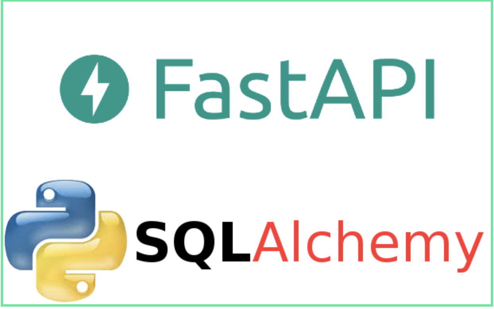
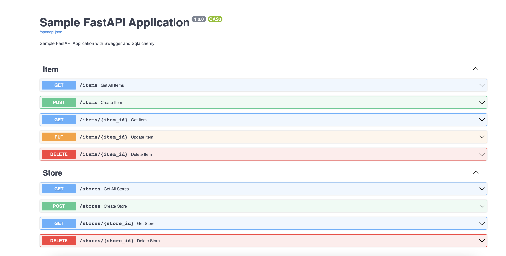

## Sample Python REST API application using [FastAPI](https://fastapi.tiangolo.com/) ,[Uvicorn](https://www.uvicorn.org/#introduction) and [SQLAlchemy](https://www.sqlalchemy.org/)



### FastAPI

FastAPI is a modern, fast (high-performance), web framework for building APIs with Python 3.6+ based on standard Python type hints.

The key features are:

**Fast**: Very high performance, on par with NodeJS and Go (thanks to [Starlette](https://www.starlette.io/) and [Pydantic](https://pydantic-docs.helpmanual.io/)). One of the fastest Python frameworks available.

**Fast to code**: It allows for significant increases in development speed.

**Easy**: Designed to be easy to use and learn. Less time reading docs.
**Short**: Minimize code duplication. Multiple features from each parameter declaration. Fewer bugs.
**Robust**: Get production-ready code. With automatic interactive documentation.
**Standards-based**: It’s based on the open standards for APIs, [OpenAPI](https://github.com/OAI/OpenAPI-Specification) and [JSON Schema](https://json-schema.org/).

### Uvicorn

Uvicorn is a lightning-fast ASGI server implementation, using [uvloop](https://github.com/MagicStack/uvloop) and [httptools](https://github.com/MagicStack/httptools).

Until recently Python has lacked a minimal low-level server/application interface for asyncio frameworks. The ASGI specification fills this gap, and means we're now able to start building a common set of tooling usable across all asyncio frameworks.

ASGI should help enable an ecosystem of Python web frameworks that are highly competitive against Node and Go in terms of achieving high throughput in IO-bound contexts. It also provides support for HTTP/2 and WebSockets, which cannot be handled by WSGI.

Uvicorn currently supports HTTP/1.1 and WebSockets. Support for HTTP/2 is planned.

### SQLAlchemy

SQLAlchemy is the Python SQL toolkit and Object Relational Mapper that gives application developers the full power and flexibility of SQL.

It provides a full suite of well known enterprise-level persistence patterns, designed for efficient and high-performing database access, adapted into a simple and Pythonic domain language.

### Pydantic

Data validation and settings management using python type annotations.

pydantic enforces type hints at runtime, and provides user-friendly errors when data is invalid.

## Setting up the VirtualEnv and install dependencies

Go inside the project folder and execute the below commands. We will use [Pipenv](https://pypi.org/project/pipenv/) to setup the VirtualEnv.

```
pipenv shell
pipenv install

```

Dependencies will be installed from the Pipfile. Python version 3.9.2 is used for this project.

## Run the Application

```
python main.py

```

This will start the application on port 9000

## Test the application

FastAPI also automatically generated fully interactive API documentation that we can use to interact with our API. 
We can visit http://127.0.0.1:9000/docs in our browser to see the interactive API documentation provided by [Swagger UI](https://github.com/swagger-api/swagger-ui):



The server will start at <http://localhost:9000/docs>.


Please check my write-up for further details <https://dassum.medium.com/building-rest-apis-using-fastapi-sqlalchemy-uvicorn-8a163ccf3aa1>
